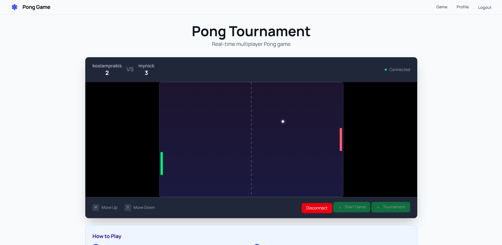
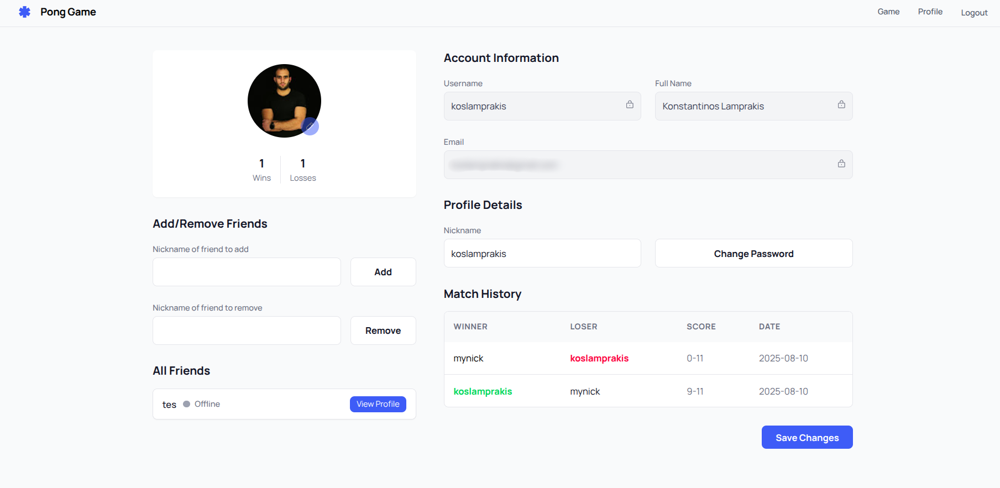

# 🕹️ Pong Arena — Realtime Web Pong Game with Auth & Microservices

Welcome to **Pong Arena**, a full-featured web-based Pong game that lets users play online in real-time. Designed with a modern microservice architecture and built using cutting-edge web technologies, this project includes secure user authentication, Two-Factor Authentication (2FA), Google Sign-In, and a sleek, responsive UI powered by Tailwind CSS.

## 🚀 Features

- 🎮 **Online Realtime Pong Game**  
  Play Pong with other players directly in your browser.

- 🔐 **User Authentication**  
  Secure signup/sign-in system.

- 🔒 **Two-Factor Authentication (2FA)**  
  Enhanced account security via TOTP-based 2FA.

- 🌐 **Google Sign-In Integration**  
  Authenticate quickly using your Google account.

- 👤 **Profile Management**  
  Update your profile and manage your personal information.

- 🧩 **Microservices Architecture**  
  Scalable backend powered by Node.js and Dockerized services.

- 🎨 **Responsive UI**  
  Beautifully styled with Tailwind CSS.

## 🛠️ Tech Stack

- **Backend:** Node.js (Microservices)
- **Frontend:** HTML/CSS (Tailwind CSS)
- **Authentication:** 2FA, Google OAuth
- **Containerization:** Docker
- **Orchestration:** Makefile

## 🧑‍💻 Getting Started

### 📦 Prerequisites

- Docker (Docker Daemon running)
- `make` installed

### 🚀 Run The App

- run `make docker-up` at project root. Then just visit `127.0.0.1`

